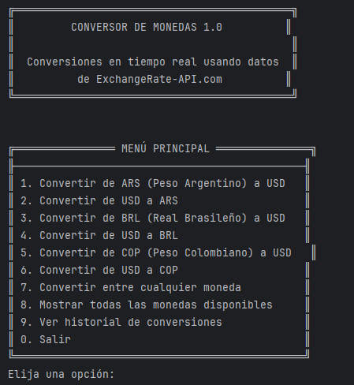

# Conversor de Monedas 1.0 💰



Un conversor de monedas en tiempo real que utiliza datos de ExchangeRate-API.com, con interfaz de consola amigable y registro de historial de conversiones.

## Características ✨

- ✅ Conversión en tiempo real entre múltiples monedas
- ✅ Historial de las últimas 10 conversiones
- ✅ Interfaz de consola intuitiva con formato atractivo
- ✅ Soporte para más de 150 monedas diferentes
- ✅ Manejo de errores robusto

## Opciones disponibles 📌

1. Conversiones predefinidas (ARS↔USD, BRL↔USD, COP↔USD)
2. Conversión entre cualquier par de monedas
3. Visualización de todas las monedas disponibles
4. Historial de conversiones recientes

## Estructura del proyecto 📂

```
src/
├── api/
│   ├── CurrencyApiClient.java    # Cliente para la API de tasas de cambio
│   └── CurrencyConverter.java    # Lógica de conversión de monedas
├── model/
│   ├── ConversionRecord.java     # Modelo para registrar conversiones
│   └── ExchangeRateResponse.java # Modelo para la respuesta de la API
├── service/
│   └── ConversionHistory.java    # Gestión del historial de conversiones
├── ui/
│   └── ConsoleUI.java            # Interfaz de usuario por consola
└── util/
    └── ConfigLoader.java         # Cargador de configuración
```

## Requisitos 📋

- Java JDK 11 o superior
- Conexión a internet (para acceder a ExchangeRate-API)
- Archivo `application.properties` con las credenciales de la API

## Configuración ⚙️

1. Crear un archivo `application.properties` en `src/main/resources/` con el siguiente contenido:

```properties
api.key=tu_api_key_aqui
api.base_url=https://v6.exchangerate-api.com/v6/
```

## Cómo usar 🚀

1. Compila y ejecuta el proyecto

```
javac -d bin src/**/*.java
java -cp bin ui.ConsoleUI
```

<div class="text-center my-4">
  <p class="text-lg font-semibold">2. Sigue las instrucciones en pantalla</p>
  
</div>

## ⭐​ Insignia de logro

Insignia de logro por completar el challenge **Practicando con Java: Challenge Conversor de Monedas**

<p align="center">
  
</p>
